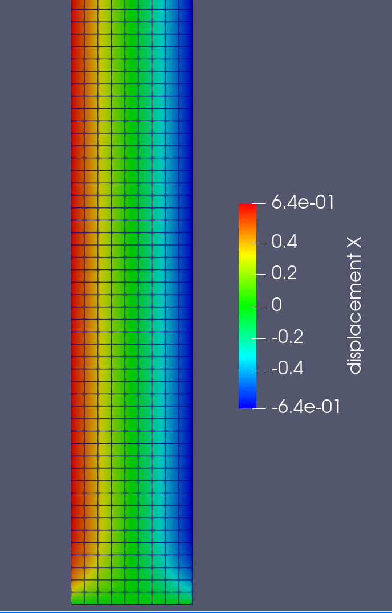

# Finite Element Method (FEM) Solver in C++

## Introduction

This project presents a rudimentary implementation of a Finite Element Method (FEM) solver written in C++. It demonstrates the application of the FEM to solve basic problems, such as an elastic tension rod simulation. The implementation, while not comprehensive or optimized, aims to provide an understanding of the linear FEM.

Inspired by Dr. Jorgen Bergstrom's [Full Finite Element Solver in 100 Lines of Python](https://polymerfem.com/full-finite-element-solver-in-100-lines-of-python/), this project utilizes Eigen3 for linear algebra computations and Gnuplot and VTK(ParaView) for data visualization.

## Dependencies

The following tools and libraries are required to build and run this project:

- [CMake](https://cmake.org/)
- A C++ compiler (gcc / clang++ etc.) 
- [Eigen3](https://eigen.tuxfamily.org/index.php?title=Main_Page) (header only)
- [GnuPlot](http://www.gnuplot.info/)
- [VTK](https://vtk.org/)
- [ParaView](https://www.paraview.org/)

## Build Instructions

Once the dependencies are installed, you can proceed with the build process:

1. Clone the repository to your local machine.
2. Navigate to the root directory of the project.
3. Run the build script using the command: `sh build`
4. (or if you want to build and run the project: Run the sh script using the command: `sh build_and_run.sh`)

## Screenshots: 

## Further Information

<!-- For further details on how to get started, refer to the project's [documentation](Link_to_documentation). If any issues arise during the build process, please refer to our [troubleshooting guide](Link_to_troubleshooting_guide). -->
